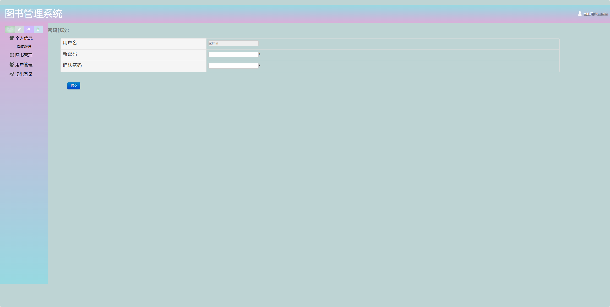
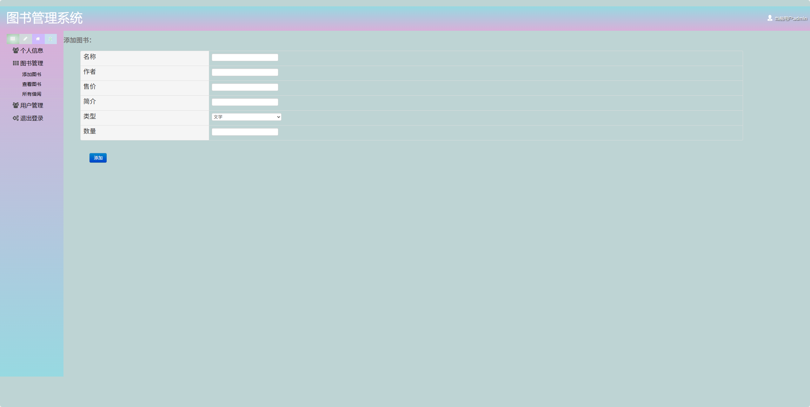
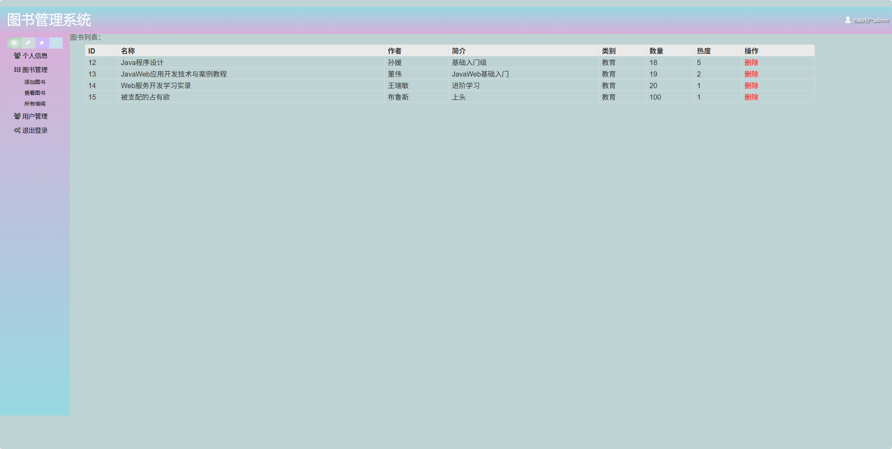
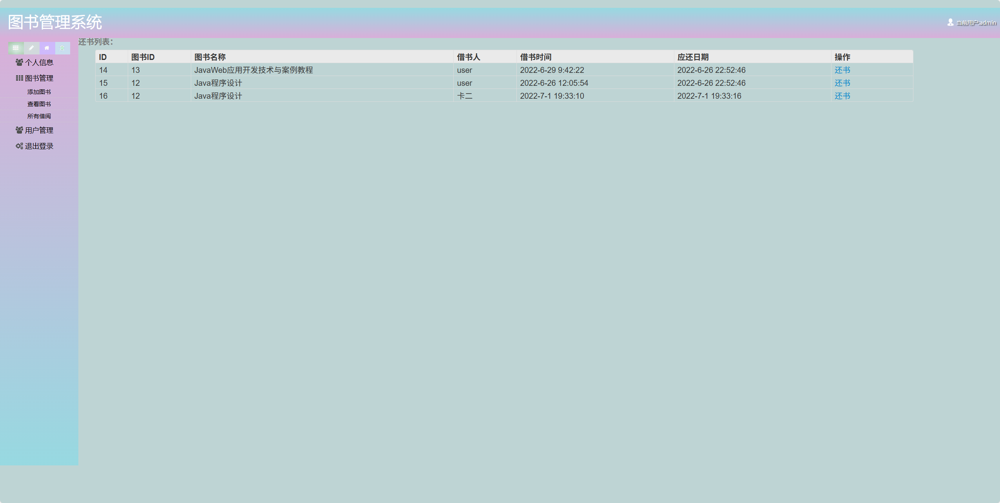
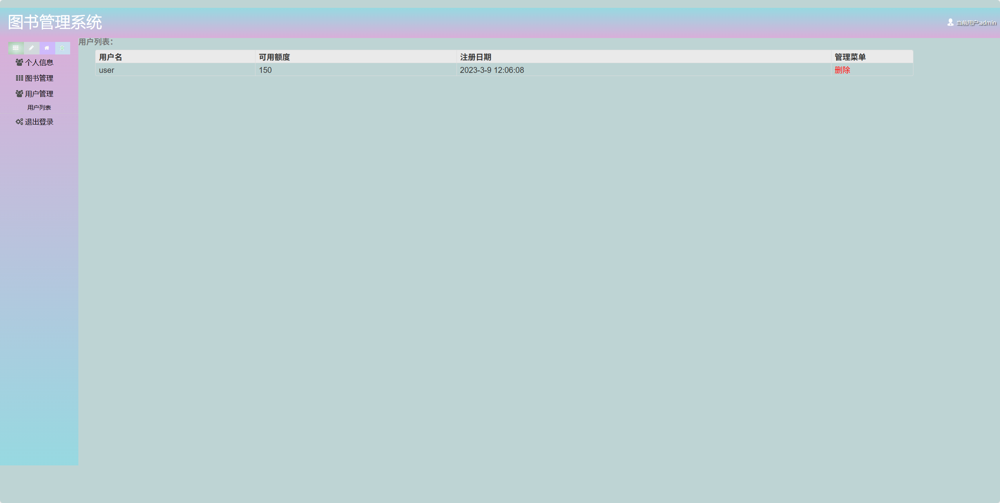
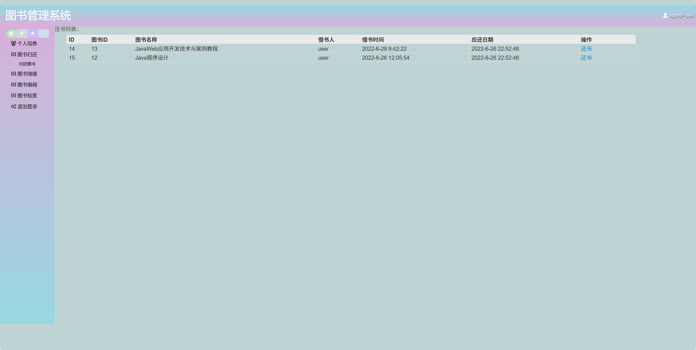
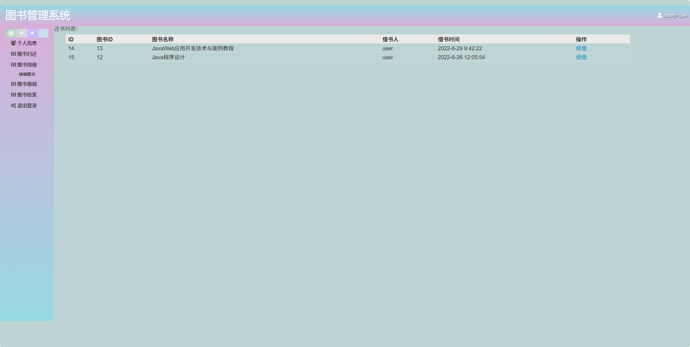
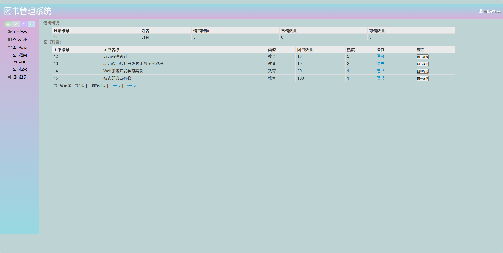
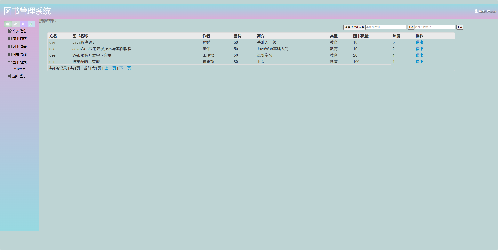

# 图书管理系统(文末免费领取☟)
> 
#### 介绍
图书管理系统(Java_SSH)
有BUG可留言加微

#### 软件架构
Java + Spring + SpringMVC + Hibernate + Mysql

#### 项目功能说明

1.  管理员功能
> + 个人信息：修改密码
> + 图书管理：添加图书、查看图书、所有借阅
> + 用户管理：用户列表
>   退出登录
2.  普通用户
> + 个人信息
> + 图书归还：归还图书
> + 图书续借：续借图书
> + 图书借阅：图书列表
> + 图书检索：查找图书
> + 退出登录

### 部分功能演示

### 环境需求(可免费提供)
- idea/eclipse、jdk-1.8、maven-3.8.6、mysql、node.js等

## 有项目修改、安装调试需求 请联系以下

## 获取资源扫☝☝☝

